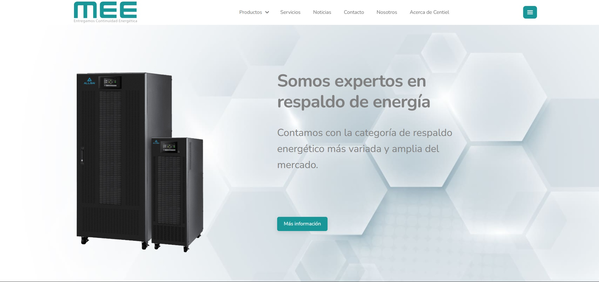
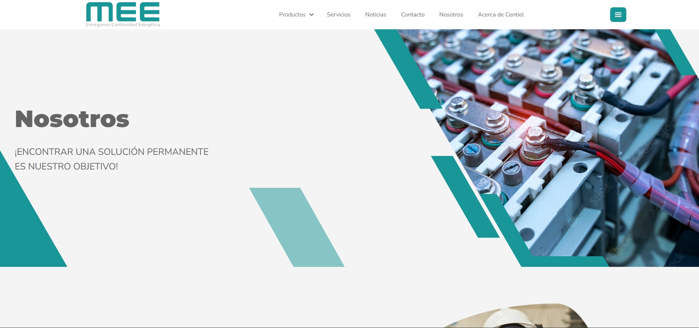

# 🌐 SPA Corporativa – MEE Perú

Este proyecto es una **aplicación web de una sola página (SPA)** desarrollada para la empresa **MEE Perú**, con enfoque en rendimiento, diseño responsivo y escalabilidad.

## 🚀 Tecnologías utilizadas

- ⚛️ [React + Vite](https://vitejs.dev/) – Framework moderno para interfaces reactivas
- 🎨 [Tailwind CSS](https://tailwindcss.com/) – Utilidades para estilos rápidos y responsivos
- 🧩 CSS Modules – Estilizado modular y reutilizable
- GSAP JavaScript animation library

## 📸 Capturas de pantalla

| Vista Principal | Vista Nosotros |
|-----------------|------------------|
|  |  |

---

## 🛠️ Instalación y uso

Sigue los siguientes pasos para correr el proyecto localmente:

```bash
# 1. Clona este repositorio
git clone https://github.com/Gitbertod/meelatam

# 2. Ingresa a la carpeta del proyecto
cd meelatam

# 3. Instala las dependencias
npm install

# 4. Inicia el entorno de desarrollo
npm run dev
```

## ✨ Características principales

- Interfaz responsiva
- Diseño modular con CSS Modules
- Navegación fluida tipo SPA
- Código limpio y mantenible
- Animaciones Modernas y fluidas para mejora de UI 

---

## 👨‍💻 Autor

**Gilberto Javier Díaz Pimentel** – [@Gitbertod](https://github.com/Gitbertod)

---

## 📃 Licencia

Este proyecto fue desarrollado exclusivamente para la empresa **MEE Perú**. No se permite su distribución sin autorización.

---